# EVE 商人助手

> **给 EVE Online 工业玩家用的本地桌面工具。** 它回答三个问题：这件东西现在值多少、
> 自己造划不划算、跨区倒一趟赚不赚 —— 不用再翻网页、对着表格手算。
> 估价、造舰规划、跨区价差、市场大盘、合同捡漏、库存成本都在一个窗口里，
> 数据存在你自己的机器上。

[](LICENSE)

📖 **在线文档**：[hermannmayer.github.io/EVE-Online-Industrial-Assistant](https://hermannmayer.github.io/EVE-Online-Industrial-Assistant/) — 使用手册 / 安装指南 / 开发文档 / API 参考
📝 **更新日志**：[CHANGELOG.md](CHANGELOG.md)

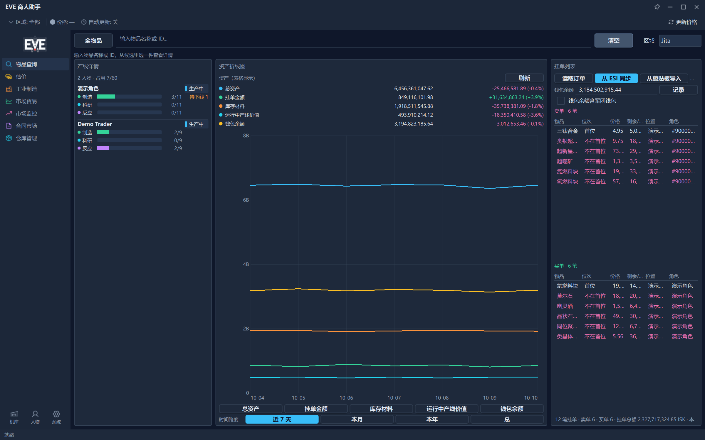

*打开软件的第一屏。左侧是七个导航页：物品查询、估价、工业制造、市场贸易、市场监控、
合同市场、仓库管理。顶栏管「价格取自哪个贸易中心、有多新、要不要更新」，
中间是不查东西时显示的仪表盘（产线详情、资产折线图、挂单列表），底部状态栏报当前在做什么。*

---

## 它替你解决什么

### 1. 「我要造一条船，得先知道几十种材料各买多少、一共多少钱」

游戏里给的是材料清单，不给总价；材料还要按 ME 等级、星系成本指数、设施税率、SCC 附加费
一层层折算。一次算错，整条产线的利润就是假的。

**软件怎么做**：把蓝图放进「工业制造」的计划大表，一张 20 列的表把材料成本、安装费、
成品价值、单件利润、个人利润率、生产时长、产能全排开；材料够不够、缺哪几样、要买多少钱，
走「采购小助手」一屏看完，清单还能直接复制回游戏下单。

### 2. 「跨区倒货，不知道 A 到 B 哪条线真的值得跑」

价差大不代表能赚钱 —— 一端可能根本没有对手盘，或者体积太大吃满货舱。

**软件怎么做**：「市场贸易」页选好起点、终点的贸易中心，一次算出**全品类**的价差排行，
按「每方利润」排（仓位才是硬约束），带两端日成交量和挂单变化，还能一键筛掉没有对手盘的货。

### 3. 「仓库里这一堆东西到底值多少钱，我心里没数」

按最低卖单价估最接近能卖出的钱，但盘口太薄时，**一根离群卖单就能把库存估值抬到几百亿**。

**软件怎么做**：仓库管理按加权平均成本记账，这堆东西值多少、有多少被生产计划占着、
还缺哪些料，都在一张表里；同时有一道**价格可信度护栏** —— 卖侧盘口太薄、或者根本没有买盘的
品种会被标成「⚠ 市价不可信」并剔出合计，还会告诉你剔掉了多少（见下文「价格可信度护栏」）。

### 4. 「钱包余额、一堆挂单，靠记事本和记忆在管」

钱进了多少、挂在市场上多少、资产是涨是跌，游戏里看不到趋势。

**软件怎么做**：挂单列表读游戏导出的订单文件，也可以直接从 ESI 同步已绑定角色的钱包余额
与未结挂单；每记一次就落一个资产快照，「资产折线图」把总资产、挂单金额、库存材料、
运行中产线价值、钱包余额五条线画出来，看趋势、看涨跌。

### 5. 「想看行情，但工具给我的是一堆没参考价值的数字」

「涨了十几万个百分点」这种数字，窗口里往往只有一笔成交。

**软件怎么做**：市场监控的「异动榜」带流动性、稳定性门槛（日均成交量、有成交的天数、
窗口内价格离散度），过不了的直接不上榜；涨幅达到 200% 的标成「极端」，
让你自己判断是真行情还是数据问题。大盘还用五个指数告诉你现在大概处在什么位置，
并明确标注「按指数与广度规则推导，不是预测、也不是投资建议」。

---

## 核心功能

### 一、物品查询：搜一件东西，看到它的全部价钱

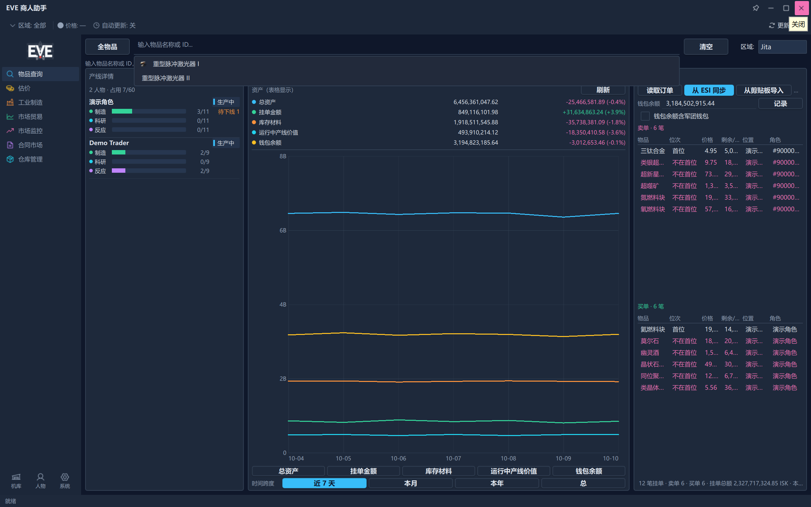

*点中候选后，主区域是四块面板：左上 = 五个贸易中心（Jita / Amarr / Dodixie / Rens / Hek）
的买价卖价，最便宜与最贵的一格会被标出；右上 = 实时 Top5 买单卖单，各带一个「复制最优价」；
左下 = 这件东西拆了能出什么矿、值多少钱；右下 = 造它要哪些料、各值多少。*

**它能干什么**

- 输入**中文名 / 英文名 / Type ID**，边打字边出候选清单；点中候选那一条**直接出详情**
  （名字按开头匹配、条数不限；数字按 Type ID 精确匹配）。搜索框空着时点一下，翻出最近搜过的词。
- 详情四块面板：五个贸易中心价格、实时 Top5 买单卖单、精炼产物与价格、制造所需材料。
- **精炼产率按人物算**：面板顶部选人物、填数量、选站点（NPC 空间站 / 玩家设施），
  产率按这个人物在人物设置里填的提炼技能算；没填就按 0 级算，宁可偏低也不按满技能估。
- 右下「制造所需的材料」改制造数量或换价格中心，整张表跟着重算，底部给按卖价 / 买价算的合计。
- 不查东西的时候，这个页面就是**首屏仪表盘**：产线详情（每个人物一块，制造 / 科研 / 反应各一行
  容量条，行尾标「待下线 N」）、资产折线图、挂单列表。
- 工具栏的「全物品」按钮把工作区切成**全物品浏览**（见下一节），再点一次「返回」回到查询。
- 右上角「区域」下拉切换查询与详情用的贸易中心。

**给你带来什么**：一次输入同时拿到「市场买价卖价 + 拆解价值 + 自造成本」三套结论，
不用在游戏市场和第三方网站之间来回切窗口；首屏那三块仪表盘让你一打开就知道产线、资产和挂单的状况。

---

### 二、估价：一整个货柜，一次算完

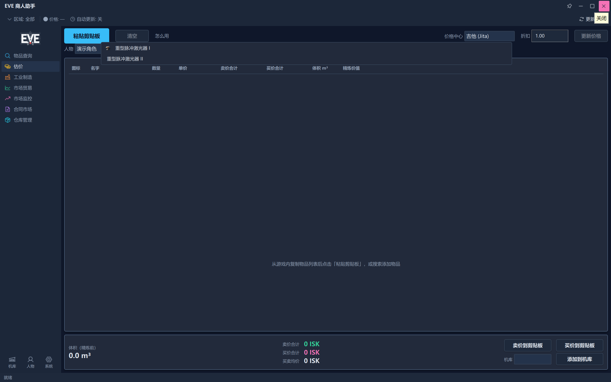

*从游戏里 Ctrl+C 复制物品列表，点「粘贴剪贴板」就自动补全价格。表格逐行列图标、名字、数量、
单价、卖价合计、买价合计、体积、精炼价值；底部给卖价 / 买价合计，以及「添加到机库」和两个复制按钮。*

**估价页（导航 → 估价）**

- 从游戏内复制物品列表（Ctrl+C）→ 点「粘贴剪贴板」→ 表格自动出价；也可以直接搜物品名加进来。
- 顶部可切价格中心、填折扣、选人物与精炼场地（「精炼价值」列按这些设置算）。
- 行上右键：复制名称、复制 Type ID、修改数量、数量翻倍、修改蓝图 ME/TE、删除条目、清空表格。
- 底部：「卖价到剪贴板」「买价到剪贴板」（纯数字，方便贴回游戏或表格），以及整批「添加到机库」。
- 工具栏的「更新价格」按钮重读本地价格并重算全表。

**全物品浏览（查询页工具栏 →「全物品」）**

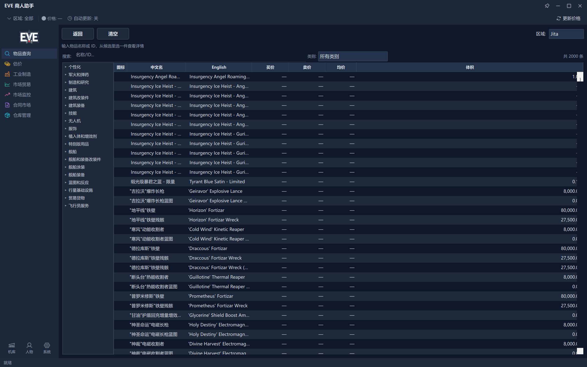

*查询页切到「全物品」后的样子：左边是市场分类树，右边是全表
（图标 / 中文名 / English / 买价 / 卖价 / 均价 / 体积），顶部搜索框筛当前列表，点表头排序。*

- 按市场分类树翻全表，分类可展开折叠；也可以用工具栏的搜索框按名字筛当前列表。
- 双击任意一行，直接回到该物品的查询详情页（和输入名字搜到的是同一个页面）。
- 再点一次工具栏的「返回」回到查询/仪表盘。

**可制造物品窗口（工业制造页 →「从全物品添加」）**

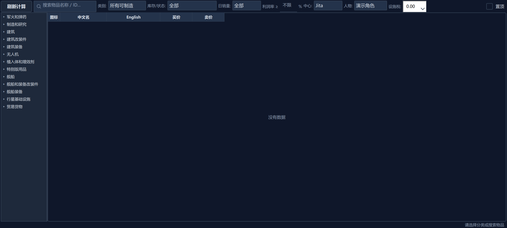

*「可制造物品」是一个独立的紧凑窗口，可以置顶挂在游戏旁边。左边分类树，右边表格带
成本 / 利润每件 / 产能每天 / 日订单量 / 日成交量 / 状态 / 利润率 %；顶栏可筛类别、库存状态、
日销量、利润率下限，并切中心、人物与设施税。*

- 只列**能造**的东西，并且能按「库中有 / 有挂单 / 无蓝图 / 有原图待拷贝 / 有拷贝待发明 /
  正在制造」过滤，一眼看出哪些手上就有料、哪些还只是蓝图。
- 列宽按内容实测，窗口尽量窄；可置顶，方便覆盖在游戏上边看边操作。
- 行上右键：复制名称、复制蓝图名称、复制整行、制造核算明细、挂单建议、加入制造列表、
  加入拷贝 / 发明 / 效率研究规划；双击一行看制造材料明细。

**给你带来什么**：一整柜战利品、一船矿产、一整页合同内容物，几秒钟就知道总值多少、哪些值得拆；
顺手「添加到机库」，库存底账就建起来了。想造点什么，就在可制造物品窗口里按利润和销量排序挑。

---

### 三、工业制造：把产线排成一张表 + 一张图

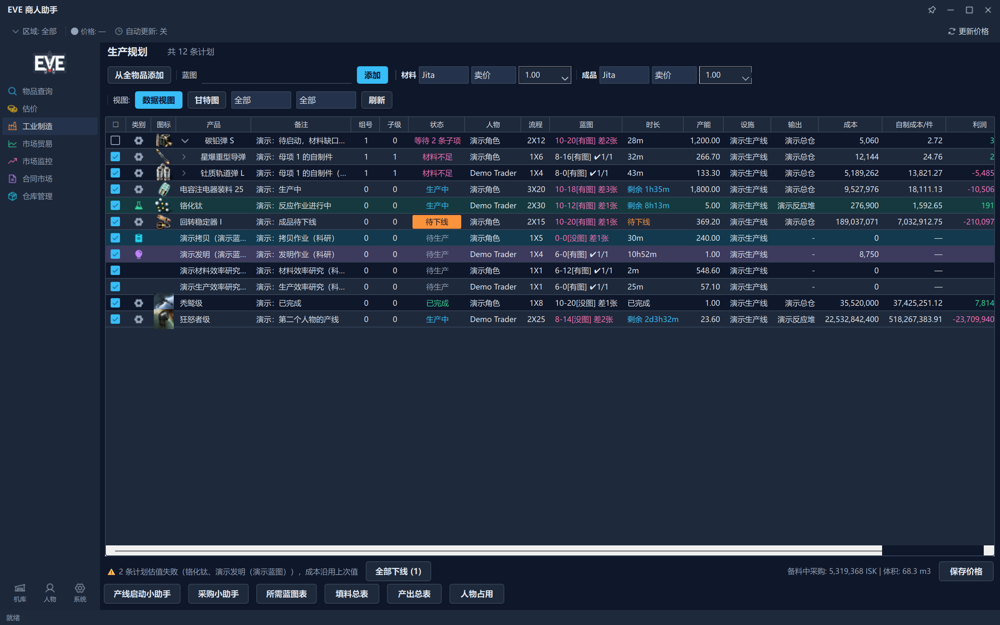

*生产计划大表。每一行是一条产线，最左边勾选列管备料，往右排到成本、自制成本 / 件、利润、
市场利润率 %、个人利润率 %。工具栏上能加蓝图、配材料 / 成品两套价格来源、按状态与类别筛行、
切到甘特图、定向刷新价格；底部是六个汇总工具。*

**它能干什么**

- **加计划**：工具栏的蓝图输入框支持中英文名实时搜索候选，选中即添加；也能从「从全物品添加」
  打开可制造物品窗口挑。一条计划可以带多条并行产线，每条产线各绑一张库存里的蓝图。
- **双行价格来源**：材料和成品各自独立配置贸易中心、买单 / 卖单 / 均价、倍率系数
  （例如材料倍率填 1.10 = 按报价再上浮 10% 当实际买入价），因此能模拟「A 区买料、B 区卖货」。
- **20 列计划大表**：备料勾选、类别（制造 / 拷贝 / 发明 / 反应）、图标、产品、备注、组号、子级、
  状态、人物、流程、蓝图、时长、产能、设施、输出、成本、**自制成本 / 件**、利润、
  市场利润率 %、个人利润率 %。备注、人物、设施三列可以直接在行内改。
- **右键编排**：编辑生产计划、绑定库存蓝图、添加备注、勾选备料、项目启动、
  撤销启动（返还材料）、下线、设为待生产（复用）、智能调整（母项递归拆解 / 子项并行配置 /
  子项大规模产线并行）、查看核算、复制蓝图名称、删除产线。
- **表头右键可以切列显示/隐藏**，把不关心的列收起来，表就不会挤。
- **两种视图**：数据视图 ↔ 甘特图。甘特图按 BOM 依赖串行排期 —— 子项先做、母项接在子项之后，
  同一母项下的多条子项并行，柱条末端给预计完成时刻，可以调时间粒度与缩放。

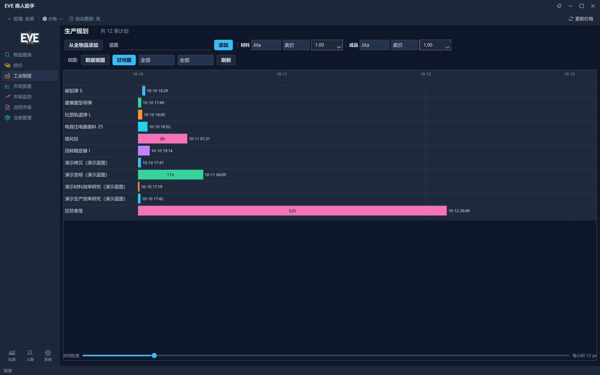

*甘特图视图：每一行对应计划树里的一个节点，母项排在它的子项后面（要等子项产出才能开工），
柱条末端是预计完成时间。*

- **工具栏**：状态筛选、类别筛选（与状态正交）、数据视图 / 甘特图切换、「刷新」（只拉活跃计划
  涉及的物品价格，不为了几条产线去拉整个宇宙的订单簿）、「保存价格」。
- **六个汇总工具**：产线启动小助手、采购小助手、所需蓝图表、填料总表、产出总表、人物占用。
  其中只读汇总表双击任一格即可复制那一格的文字，方便拿去游戏里搜。
- **采购小助手**是一个可置顶悬浮的小窗：清单按「需采购 / 库存已备足」两个分区列出
  物品名称、总需求、需采购、买卖差价、总价、自制成本每件，能排序、能手改采购量、
  能删掉本次不买的行；底部可复制整份清单回游戏下单、把买到的材料「增量添加到仓库」、
  从「钱包 → 交易记录」粘贴入库、也能一键完成所有待下线的计划。
- **个人利润率**：已经有的材料按你入库时的**加权平均成本**算，缺的那部分按市场价算 ——
  所以它回答的是「照我现在的家底做，真实赚多少」，而不是「全按市价买卖赚多少」。

**给你带来什么**：排产、备料、算钱、看进度在同一个页面里闭环。材料够不够、缺哪几样、谁在占线、
什么时候做完，不用再自己维护一张表格。

---

### 四、市场贸易：A 区买、B 区卖，哪条线值得跑

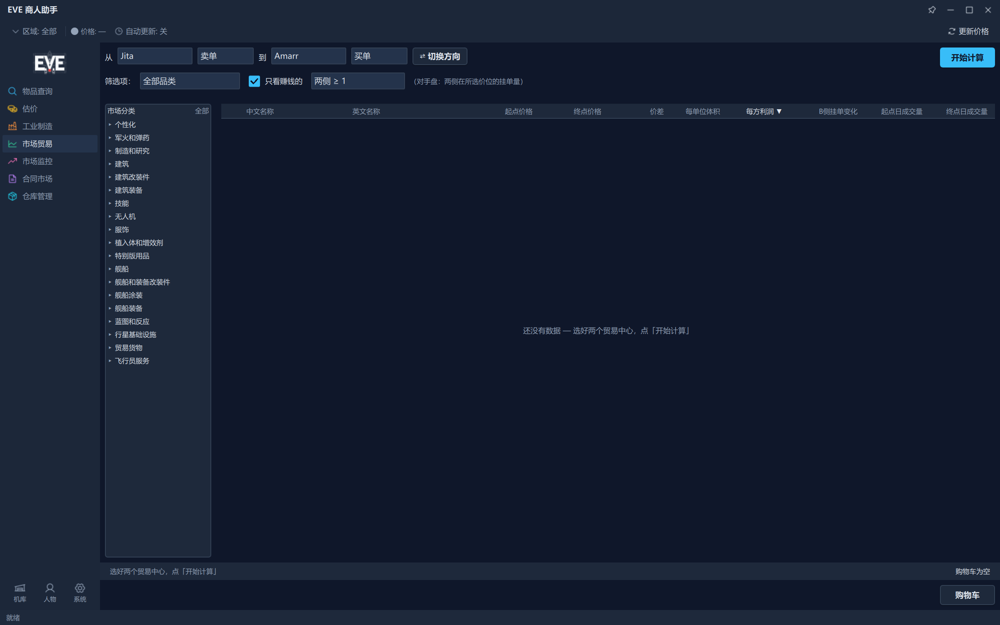

*市场贸易页。顶上选「从哪个中心、按什么价买」和「到哪个中心、按什么价卖」，
点「开始计算」出全品类价差排行：价差、每单位体积、每方利润、B 侧挂单变化、两端日成交量，
每行右侧可以加入购物车。*

**它能干什么**

- **A → B 全品类价差排行**：选起终点贸易中心、各自的价格口径（卖单 / 买单），一键切换方向。
  五个贸易中心是 **Jita / Amarr / Dodixie / Rens / Hek**（估价页与机库标签里会显示成
  「吉他 (Jita)」这样的中文加英文对照形式，本页与查询页的价格面板只显示英文键）。
- **按「每方利润」排**：仓位和体积是硬约束，所以除了价差，还给出每单位体积、每方利润、
  B 侧挂单变化（有人在吃单）、两端近 7 天日成交量；点表头可以换列排序。
- **筛选项**：「只看赚钱的」、对手盘门槛（两侧 ≥ 1 / ≥ 10 / ≥ 100）；再叠加市场分类下拉，
  或者用左侧分类树精确到子分类，还带「当前结果里这个分类下有没有物品」的提示。
- **只读本地价格**：点「开始计算」不发任何网络请求，只用本地已有的价格快照，所以点起来很快；
  这份价格有多新，看本页状态栏（按中心逐个列出「Jita 刚刚 / Amarr 3 小时前」这样的时间）。
  要更新价格就点顶栏的「更新价格」——那是全应用拉取市场价格的入口。
- **贸易购物车**：把看中的几行丢进购物车（独立置顶窗口），逐行填数量看总计金额与总体积，
  买完标「已购买」、一键清理已购买项，还能复制物品名回游戏搜。

**给你带来什么**：出门之前就知道哪条线值得跑、一次能装多少、对面有没有人接盘；
购物车把「这趟要买哪几样、一共花多少」算成一张清单。

---

### 五、市场监控：大盘看懂位置，异动榜找线索

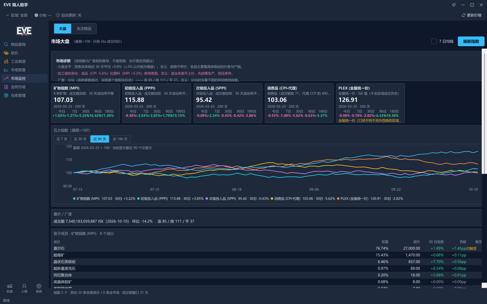

*市场监控首页是「大盘」：五个指数卡片（基期 = 100）、五条指数折线加 7 日均线开关、
量价与市场广度、篮子成员表、异动榜两个分区，右下是各中心的数据状态。*

**它能干什么**

- **五个市场指数**：矿物指数（MPI）、初级投入品（PPPI）、次级投入品（SPPI）、
  消费品（CPI·代理，按成交额取 top 篮子）、PLEX（全服统一价）；都以基期 = 100 画成折线，
  可开关 7 日均线，可切换时间粒度；卡片上给最近一个点与 7 / 30 / 90 / 180 天的涨幅。
- **量价与广度**：最新交易日的涨跌家数与成交额，用来判断当前是普涨、普跌还是分化。
- **市场诊断**：按指数与广度规则推导出的一句话判断（页面上明确写着「按指数与广度规则推导，
  不是预测、也不是投资建议」）。
- **异动榜分两区**：① 合格成分（过了指数准入与流动性门槛）；② 全市场（未过准入的也列出来
  只作线索）。涨幅达到 200% 的条目标「极端」。
- **点任意一行开右侧抽屉**：看这件东西沿 BOM 往下的逐级传导（谁涨了会带贵谁），
  以及「挂单建议」—— 两侧挂单划算 / 直接吃单更划算 / 薄市场别挂大单 / 本地没有数据。
- **行右键**：复制名称、加入关注列表、加入制造列表。
- **刷新指数**：重算大盘的逐日点位（这是本页唯一的联网动作，其余都读本地库）。

**给你带来什么**：先用大盘判断现在该买还是该卖，再用异动榜找线索，最后用「挂单建议」决定
是挂单还是直接吃单。异动榜的门槛把「一笔成交刷出来的百分比」挡在榜外，省下你自己做数据清洗的时间。

---

### 六、合同市场：把一份合同拆成「值不值」

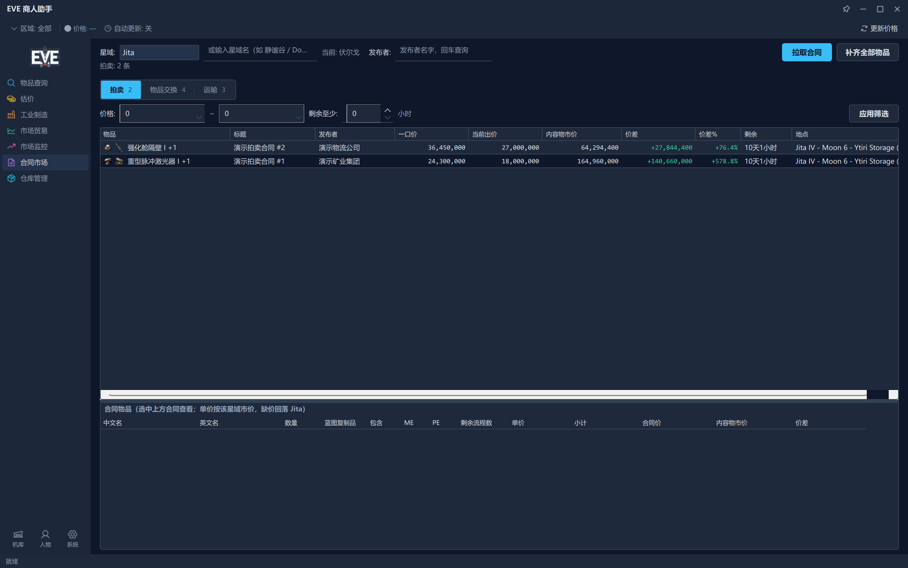

*合同市场页按类型分三个页签（拍卖 / 物品交换 / 运输），每个页签带条数徽标。
顶部可以选星域或直接输入星域名、按发布者筛选，右侧是「拉取合同 / 补齐全部物品 / 停止」，
下方是筛选条（价格、只看蓝图合同、剩余至少多少小时、跳数口径、最低安全）。*

**它能干什么**

- **三个页签，三张不同的表**：
  - **拍卖**：一口价、当前出价、内容物市价、价差、价差 %、剩余时间、地点；
  - **物品交换**：合同价、内容物市价、价差、价差 %、是否含蓝图、蓝图市价、制造利润、
    剩余时间、地点；
  - **运输**：起点、终点、跳数、方数、报酬、抵押、**每跳 ISK**、**每方每跳 ISK**、剩余时间。
- **含蓝图的合同单独算**：蓝图本身按市价算，再加上「这张蓝图按剩余流程数造出来能赚多少」，
  而不是把蓝图当成一件普通物品。
- **跳数口径可选**：不计算 / 最短路线 / 避开低安 / 自定义安全下限。选了口径才算跳数。
- **按发布者反查**：游戏里搜合同只能按发布者搜，这里输入发布者名字即可过滤他的全部合同。
- **点一份合同看物品明细**：逐行列出物品、数量、是否蓝图复制品、ME/PE、剩余流程数、单价、小计，
  表尾给这份合同的合同价、内容物市价与价差；物品表也能点表头排序。
- **右键动作**：复制发布者、复制整份物品清单、把物品加入关注列表。
- **缺价不当作 0**：算不出市价的物品会被单独计数，不会把「总市价」压低成假的折价；
  本星域查不到的价格会回落到 Jita。

**给你带来什么**：翻合同从「一份一份点开算」变成「拉一次整个星域，按价差排序扫一遍」；
运输合同直接按每跳 ISK 挑活；含蓝图的合同给你「抄下来造能赚多少」的现成结论。

---

### 七、仓库管理：库存、成本、蓝图都在这

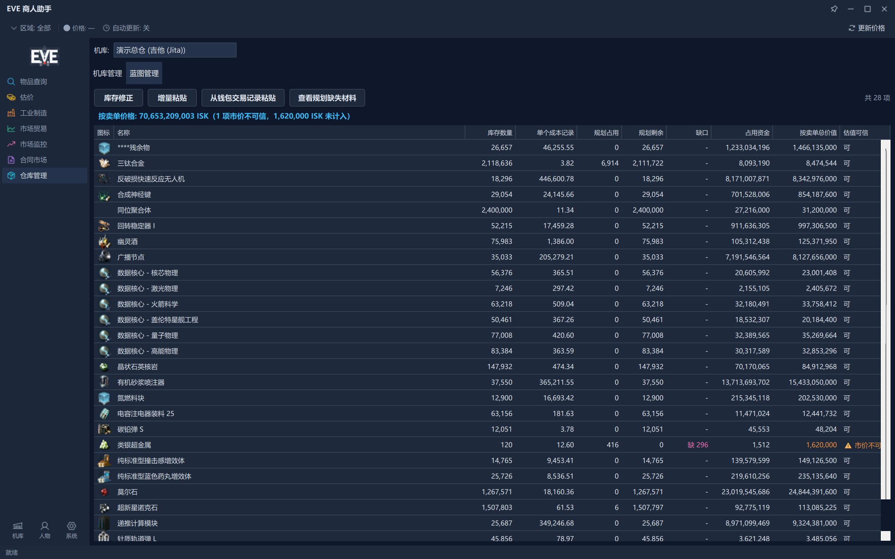

*仓库管理分「机库管理」「蓝图管理」两个页签。机库页顶部是机库切换、库存修正、增量粘贴、
从钱包交易记录粘贴、查看规划缺失材料；表格最后两列是「按卖单总价值」与「估值可信」——
离群卖单价的那一行会标「⚠ 市价不可信」，并把它从底部合计里剔出去。*

**它能干什么**

- **机库管理**：新建 / 改名 / 删除机库，物品可以在机库之间移动，支持多选批量操作。
- **物品表 10 列**：图标、名称、库存数量、单个成本记录、**规划占用**、**规划剩余**、**缺口**、
  **占用资金**、按卖单总价值、估值可信 —— 也就是说，一张表同时告诉你「这东西有多少、
  成本多少、被计划占了多少、还缺多少、值多少钱」。
- **三种入库方式**：
  - **增量粘贴**：从游戏里复制已购材料（Ctrl+C），按增量累加到指定机库，只增不减；
  - **从钱包交易记录粘贴**：把「钱包 → 交易记录」里负 ISK 的买入行，按**记录里的单价**入库当成本；
  - **库存修正**：走一份可逐行审阅的修正预览表（可只显示有变动的行、批量套用折扣、
    从市场价回填单价、搜索匹配未识别的行），改完再落库。
- **成本价**：多次入库同一物品按**加权平均成本**累计，可批量设置成本价；这个数就是制造页
  「个人利润率」的输入。
- **看规划缺什么**：「查看规划缺失材料」按当前计划与库存算出缺口。

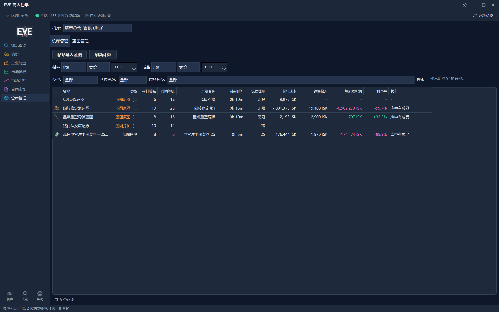

*蓝图管理页：13 列的蓝图清单（图标 / 名称 / 类型 / 材料等级 / 时间等级 / 产物名称 / 制造时间 /
流程数量 / 材料成本 / 销售收入 / 每流程利润 / 利润率 / 状态），顶部两行是材料与成品的价格来源。*

- **蓝图管理 13 列**：除了 BPO / BPC、ME / TE、流程数、所在机库，还按你配置的材料 / 成品价格
  算出每张蓝图的材料成本、销售收入、每流程利润与利润率，可以直接和「买成品」比。
- **蓝图右键**：研究分析、删除行、修改蓝图所在机库、修改蓝图每流程成本、
  自动填写每流程成本（T2 发明）、修改蓝图等级、修改流程数，以及一键加入
  **制造 / 拷贝 / 发明 / 效率研究**四种规划；也可「粘贴导入蓝图」从游戏复制一份库存清单进来。
- **表格手感**：两张表都支持点表头排序，排序状态在刷新、移库、切机库之后依然保持。
- **底部合计说实话**：显示「按卖单价格: X ISK（N 项市价不可信，Y ISK 未计入）」。

**给你带来什么**：库存有账、成本有据。做计划时材料按真实持有成本抵扣，不会出现
「账面很赚、实际按市价买料亏了」的落差；蓝图页还能告诉你哪张蓝图值得开、哪张还不如直接买成品。

---

### 八、本地优先：数据在你机器上

- **四个 SQLite 库都放在本地 `database/` 目录**：参考数据、市场价格、蓝图数据、用户数据分开存放；
  你的库存、计划、挂单、钱包余额这些**用户数据只在 `user.db`** 里。
- **不需要注册我们的账号**，也不会上传你的库存或计划。物品与行情数据来自公开的 SDE / ESI。
- **行情本体存在你自己的库文件里**：价格与合同数据来自公开的 ESI，需要时联网拉取并落进本地
  SQLite 库；查询、排行、评分、估值都是对本地库的查询，不依赖网络。
- **有些动作会自动联网**：进入物品查询并选中一件物品时会自动去取它的订单；
  进入合同页、切页签时若有还没补齐物品的合同，也会在后台自动补齐。
  界面会显示价格是哪个中心、什么时候拉到的。
- **自带备份**：设置页可以开「每天自动备份」、限制最多保留几份、随时「立即备份」或
  「导出用户数据…」，也能一键「还原选中备份」（还原前会先把当前库也备一份，选错还能退回来）。
- **主题**：界面提供 **Fluent 深色** 与 **Fluent 浅色** 两套主题，点卡片即时切换、偏好自动保存，
  另有全局字号可调。

*系统设置分「ESI 与数据 / 外观 / 默认参数 / 备份」四个标签：价格自动更新的开关与间隔、
主题卡片与全局字号、数据初始化与关于、用户数据备份的保留份数与还原。*

### 九、价格可信度护栏

这是估价类工具最容易出问题的地方：**用最低卖单价估库存，一根离谱的离群卖单就能把估值抬上天。**

- **判据（三态）**：完全没有卖价 → 不参与判断（也**不算**「不可信」，否则基础矿物会把
  「未计入」刷成大数字）；有卖价但卖侧盘口量低于阈值、且相对买侧不足一定比例，或者干脆
  **没有买盘** → 判「市价不可信」；其余放行。两侧都薄但卖侧够量的品种会放行，
  薄而真实的市场不被误杀。
- **效果**：不可信的行**不计入合计金额**，底部如实写明「N 项市价不可信，Y ISK 未计入」；
  表格里那一行标「⚠ 市价不可信」，金额与可信度两列一起标橙 —— **数字照常显示，不藏虚高值**，
  你自己能判断它是不是真的。
- **取价本身也防凑数**：跨贸易中心取价不是直接取最低卖单，而是按挂单量累计取价，
  跳过「只有一两个」的凑数挂单；阈值受「该侧总量 1%」与「挂单量中位数」双重封顶，
  一笔 1 ISK × 巨量的钓鱼单抬不动它。
- **口径统一**：同一套判据同时用在库存估值与资产快照上，不会出现「这个页面一个数、
  另一个页面另一个数」的落差。

---

## 功能与好处一览表

| 功能 | 你能拿它做什么 | 在哪 |
|------|----------------|------|
| 物品查询 | 搜中/英文名或 Type ID，看五个中心价格、最优买卖单、精炼产物、制造材料 | 导航 → 物品查询 |
| 首屏仪表盘 | 一打开就看到产线占用、资产折线、挂单列表 | 物品查询页（未选中物品时） |
| 全物品浏览 | 按市场分类树翻全表，点表头排序，双击一行看详情 | 物品查询页工具栏 → 全物品 |
| 粘贴估价 | 从游戏复制物品列表，一次算出整批的买价 / 卖价 / 精炼价值 | 导航 → 估价 |
| 可制造物品窗口 | 只列能造的东西，按利润 / 销量 / 库存状态筛，置顶挂在游戏旁边 | 工业制造页 → 从全物品添加 |
| 制造核算明细 / 挂单建议 | 看单个物品的制造费用明细，或该挂单还是直接吃单 | 可制造物品窗口 → 右键 |
| 工业制造规划 | 20 列计划表管材料、安装费、利润、时长；右键启动 / 下线 / 复用 / 拆解 | 导航 → 工业制造 |
| 列显示开关 | 表头右键收起不关心的列 | 工业制造 → 计划表表头右键 |
| 甘特图 | 按 BOM 依赖看子项与母项什么时候做完 | 工业制造页 → 视图切换 → 甘特图 |
| 采购小助手 | 待采购清单（含自制成本 / 件），复制下单、增量入库、一键完成 | 工业制造页底部按钮 |
| 汇总工具 | 所需蓝图表、填料总表、产出总表、人物占用、产线启动小助手 | 工业制造页底部按钮 |
| 跨区价差排行 | A 区买 B 区卖，全品类按每方利润排行，筛掉没对手盘的货 | 导航 → 市场贸易 |
| 贸易购物车 | 把候选货丢进置顶小窗，填数量算总额与体积，标记已购买 | 市场贸易页 → 购物车 |
| 市场大盘 | 五个指数、量价与广度、市场诊断、篮子成员 | 导航 → 市场监控 → 大盘 |
| 异动榜 | 带流动性 / 稳定性门槛的涨跌榜，过门槛与全市场分两区 | 市场监控 → 大盘 → 异动榜 |
| BOM 传导链 / 挂单建议 | 谁涨了会带贵谁；这件东西该挂单还是直接吃单 | 市场监控 → 点任意物品行 |
| 关注物品 | 关注列表 + 买价 / 卖价阈值提醒 + 备注 | 导航 → 市场监控 → 关注物品 |
| 合同市场 | 拍卖 / 物品交换 / 运输三类合同按价差、每跳 ISK 排序，含蓝图合同算制造利润 | 导航 → 合同市场 |
| 仓库管理 | 机库与蓝图两套账，加权平均成本，规划占用 / 缺口 | 导航 → 仓库管理 |
| 库存录入 | 增量粘贴、从钱包交易记录粘贴、库存修正预览 | 仓库管理 → 机库管理 |
| 蓝图经济性 | 每张蓝图的材料成本、销售收入、每流程利润、利润率 | 仓库管理 → 蓝图管理 |
| 本地数据与备份 | 数据只在本地，每天自动备份、随时导出 / 还原 | 系统设置 → 备份 |
| 双主题 | **Fluent 深色 / Fluent 浅色** 即时切换，偏好自动保存（另有全局字号） | 系统设置 → 外观 |
| 价格可信度护栏 | 离群卖单被标「市价不可信」并从估值中剔除，并告诉你剔了多少 | 仓库管理 → 机库管理（自动） |

---

## 快速开始

### 环境要求

- **Python 3.14+**
- **Windows**：发行包是 Windows 可执行文件。

### 1. 安装 uv（依赖管理器）

```powershell
powershell -ExecutionPolicy ByPass -c "irm https://astral.sh/uv/install.ps1 | iex"
```

装完执行 `uv --version` 确认。

### 2. 克隆仓库并安装依赖

```bash
git clone https://github.com/Hermannmayer/EVE-Online-Industrial-Assistant.git
cd EVE-Online-Industrial-Assistant

uv sync --dev          # 安装运行 + 开发测试依赖

# 激活虚拟环境（可选 —— uv run 会自动使用）
.venv\Scripts\activate
```

### 3. 启动

```bash
# ① 正常启动
python Main.py

# ② 开发模式：改了 .py / .qml 自动重启
python dev.py

# ③ 打包版：双击发行包里的 exe
python build_release.py            # 打包，产物在 dist/EVE商人助手_v*/ 下
```

> 别用裸 `python`。本机 PATH 上的 `python` 可能是不带依赖的系统解释器，
> 请用虚拟环境里的解释器（`.venv\Scripts\python.exe`）。

### 4. 首次启动会做什么

*数据初始化向导：逐项检查数据库结构、物品数据、价格基础数据、工业数据、植入体数据、
结构改装件数据、蓝图数据、SDE 扩展数据（星系 / 设施）、物品图标等，每步一个状态与进度，
失败可单步重试，非关键步骤可以跳过；底部是总进度与已用时间。*

首次启动会自动跑一遍数据初始化：建库、从 SDE 拉物品与蓝图数据、拉一份基础价格兜底、
缓存物品图标。SDE 那一份下载解析比较久，之后就快了。全部就绪时向导会自动关掉。

**打包版注意**：`dist/EVE商人助手_v*/` 里的 `database/` 与 `data/` 必须和 exe 待在一起
（**整个目录一起解压**）。发行包内置了只读的物品库与蓝图库模板，首启即刻可用，
不必重新下载解析上百 MB 的 SDE。

### 5.（可选，但推荐）绑定角色

绑定角色后，软件才读得到你**角色上的数据**（钱包余额、未结挂单、技能等级、植入体）：

1. 打开人物设置 → 技能页 → **从 ESI 添加角色**，会开浏览器让你在 EVE 官方登录页授权；
2. 想在挂单面板里同步钱包余额与未结挂单，用面板上的**从 ESI 同步**；
   想把军团钱包也算进总资产，勾一下「钱包余额含军团钱包」（需要角色的军团会计权限，
   首次开启要重新授权一次）；
3. 「刷新当前角色」可以静默刷新技能与植入体等级，不用每次都开浏览器。

没有绑定角色也能用：估价、制造规划、库存、贸易排行、合同、大盘读的都是公开数据或本地数据。

### 常见问题

- **界面缺数据 / 少东西？** 先跑一次系统设置 → 数据初始化。
- **资产折线图是空的？** 它从你**第一次记录那天**开始按天累积。导入一次挂单、或填一次钱包余额，
  就把今天这一天记下来了。
- **「读取订单」说没找到文件？** 先在游戏里「钱包 → 订单」点导出，文件落在
  `我的文档\EVE\logs\Marketlogs\`；软件固定读这个目录里最新的一份。
- **贸易页点「开始计算」没有新价格？** 它只用本地快照，不联网。点顶栏的「更新价格」。
- **报错说找不到 `.venv`？** 先跑 `uv sync --dev`。

---

## 开发者说明

### 技术栈

| 技术 | 用途 |
|------|------|
| [PySide6](https://www.qt.io/qt-for-python)（Qt 6 / QML） | 界面框架 |
| [aiohttp](https://docs.aiohttp.org/) | 异步 HTTP（ESI / SDE） |
| [aiosqlite](https://aiosqlite.omnilib.dev/) | 异步 SQLite |
| [tenacity](https://tenacity.readthedocs.io/) | 请求重试 + 指数退避 |
| PyYAML | 解析 SDE 的 YAML 数据 |
| openpyxl | Excel 写入（`core/export_helper.py`） |
| SQLite（4 库分离） | 参考数据 / 行情 / 蓝图 / 用户数据 |
| [PyInstaller](https://pyinstaller.org/) | 打包为可执行文件 |
| ruff / mypy / pre-commit | 风格、类型、提交前检查 |
| pytest / pytest-qt | 测试 |
| uv | 依赖与虚拟环境管理 |

### 分层架构

```
bootstrap/   组合根（IOC 容器）
   ↓
core/        工具层（常量、路径、公式、容器、日志）
domain/      领域层（纯函数：评分、BOM 展开，无 DB / 无 Qt）
services/    业务层（数据库、定价、评分、库存、SDE/ESI 导入器）
   ↓
ui_qml/      界面层（QML 页面 + Python 桥 / 模型 / worker / 视图控制器）
```

界面是 **QML 页面 + Python 桥**：页面只管画，业务逻辑在 `services/` 与 `ui_qml/views/`，
异步耗时任务走 QThread + Signal。数据库按数据生命周期拆成四个独立 SQLite 文件，
通过 `ATTACH DATABASE` 支持跨库联合查询。

### 目录结构

```
EVE-Online-Industrial-Assistant/
├── Main.py                  # 入口点（PySide6 App）
├── dev.py                   # 热重载开发启动器
├── build_release.py         # PyInstaller 打包脚本
│
├── bootstrap/               # 组合根 / IOC 容器
├── core/                    # 工具层（常量、路径、公式、容器、日志、导出）
├── domain/                  # 领域层（纯函数：评分、BOM 展开、盘口深度）
├── services/                # 业务层（数据库、定价、评分、库存、数据导入）
│   ├── importers/           # SDE / ESI 导入器
│   └── repositories/        # 数据访问
├── ui_qml/                  # 界面层（QML 外壳 / 页面 / 对话框 + 桥 / 模型 / worker / 视图）
├── scripts/                 # 维护脚本（测试分档、界面快照、API 文档生成等）
├── docs/                    # 文档站（VitePress，在线版见顶部链接）
│
├── database/                # SQLite 库
├── data/                    # 运行时数据与静态数据表（设置、缓存、图标、术语表）
├── tests/                   # pytest 测试
│
├── pyproject.toml           # 项目配置 + 依赖声明（uv 管理）
├── uv.lock                  # 依赖锁文件
├── CHANGELOG.md             # 更新日志
└── CLAUDE.md                # 项目约束与开发规约
```

### 常用命令

```bash
uv sync --dev                        # 安装依赖（首次 / 依赖变更后）
.venv/Scripts/python.exe Main.py     # 生产启动
.venv/Scripts/python.exe dev.py      # 热重载开发

uv run ruff check . --fix            # 风格检查与自动修复
uv run mypy .                        # 类型检查

.venv/Scripts/python.exe scripts/shell_snapshot.py            # 界面快照（离屏，验结构 / 配色）
.venv/Scripts/python.exe scripts/shell_snapshot.py --real     # 界面快照（真窗口，验字形）
.venv/Scripts/python.exe scripts/shell_snapshot.py --page industry   # 切到某一页再拍
```

### 测试

```bash
scripts/run_tests.sh target     # 只跑 git 变更相关的测试文件（开发循环默认）
scripts/run_tests.sh fast       # 纯计算 / 轻服务白名单
scripts/run_tests.sh validate   # 全部业务 / DB / 计算（非 UI 档，日常默认）
scripts/run_tests.sh ui-retest  # 全部 Qt 界面 + 真 QThread（较慢，改 UI 后跑）
scripts/run_tests.sh full       # 上面两档合起来（最耗时，时机由维护者定）
```

`validate` 与 `ui-retest` 互斥、并集等于 `full`。档位耗时随机器负载波动较大，
别按固定秒数做计划；具体规则见 [CLAUDE.md](CLAUDE.md) 的「测试边界」。

### 打包

```bash
python build_release.py             # 完整打包（含 zip 发行包）
python build_release.py --skip-zip  # 只出目录，不压缩
```

输出：`dist/EVE商人助手_v{version}/`（版本号由 python-semantic-release 维护，
见 [CHANGELOG.md](CHANGELOG.md)）。

### 文档入口

- **在线文档站**：<https://hermannmayer.github.io/EVE-Online-Industrial-Assistant/>
  - 使用手册：`docs/user/`（界面总览、工业制造、库存管理、精炼、BOM 等）
  - 开发文档：`docs/dev/`（架构、数据格式、功能链路、schema 迁移、界面结构规范）
  - API 参考：`docs/api/`（函数级文档，由脚本生成）
- **项目约束与开发规约**：[CLAUDE.md](CLAUDE.md)
- **功能清单**：[docs/dev/feature-inventory.md](docs/dev/feature-inventory.md) ——
  逐功能列出「能做什么 → 对应代码入口」，用于维护本 README 与核对文案不夸大。

### 贡献

欢迎 Issue 和 PR。提交 PR 前请确保代码风格符合项目规范；PR 描述与提交信息请使用中文
（分支策略与提交规范见 [docs/dev/contribution.md](docs/dev/contribution.md)）。

---

## 已知边界

- **界面语言是中文**：各页面的按钮、表格列名、提示文案都是中文。
- **有些功能代码在仓库里，但当前界面没有入口**：贸易评分、批量对比、物品表导出、批量查价
  这几项的服务与界面实现都在，但没有可点到的入口；本文只写当前点得到的部分。
- **价格走势图对话框暂无界面入口**（它的绘图几何函数仍被资产折线图复用）。
- **程序名与文档站标题不一致**：程序自称「EVE 商人助手」（窗口标题、发行包名），
  文档站与部分文档仍写作「EVE 工业助手」。
- **价格是快照，不是实时行情**。要新价格得点「更新价格」（可开自动更新，间隔可配）。
  所有基于价格的结论都受这份快照的时效影响，界面上会显示每个中心的价格时间。
- **资产折线图从第一次记录那天开始累积**，刚装上时只有今天一个点。
- **估价依赖本地价格快照**：某个贸易中心太久没更新，那里的价格就是你上次拉到的价格。
- **用户数据在本地，删了就没了**：建议开启每天自动备份，或在动手前「立即备份」一次。
- **大盘诊断与挂单建议是按公开数据与规则推导的参考信息**，不构成投资建议。

---

## 许可与免责

本项目基于 **Apache License 2.0** 开源，详情见 [LICENSE](LICENSE)。

EVE Online 及相关商标、素材属于 **CCP hf.**。本项目是非官方的第三方工具，
与 CCP 无隶属关系，也未获其背书。物品与行情数据来自公开的 **ESI / SDE** 接口，
使用请遵守 EVE Online 第三方开发者协议；软件不代替游戏内操作，也不提供任何投资建议
（大盘与挂单建议都是由公开数据按规则推导出来的参考信息）。
