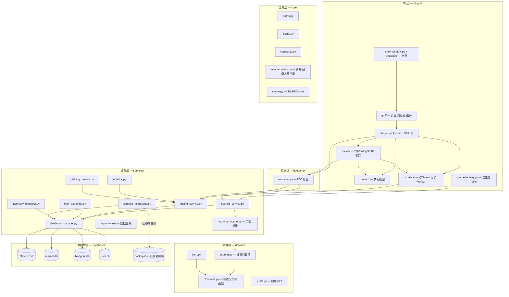

# 架构说明

## 分层架构

项目采用分层架构，职责单向依赖（上层依赖下层，下层不反向依赖）：



### 组合根（bootstrap/）

| 模块 | 职责 |
|------|------|
| `container.py` | IOC 容器（`AppContainer`）— 统一管理 DB 连接与 15+ 服务生命周期，延迟初始化、线程安全 |

### 工具层（core/）

纯工具模块，无业务依赖，无状态：

| 模块 | 职责 |
|------|------|
| `paths.py` | 所有路径集中管理（4库路径 + data 目录） |
| `logger.py` | 日志配置（文件 + 控制台） |
| `constants.py` | 全局常量（贸易中心 ID 等） |
| `container.py` | **兼容转发** — 实际实现已迁移到 `bootstrap.container`，新代码优先从 `bootstrap.container` 导入 |
| `eve_formulas.py` | 贸易费/经纪人费公式常量（制造公式在 `domain.formulas`） |
| `cache.py` | `TtlLRUCache` 线程安全 LRU + TTL 缓存 |
| `version.py` | 单一版本源（python-semantic-release 自动改写） |
| `single_instance.py` | 单实例锁（防止多开），支持自定义锁路径（instance.lock / dev.lock） |
| `hot_reload.py` | 热重载 trigger/state 文件 I/O，经 --hot-reload 启用优雅退出 |

### 领域层（domain/）

纯函数、无 DB/Qt/缓存依赖，可直接用 pytest 测试：

| 模块 | 职责 |
|------|------|
| `formulas.py` | 制造相关公式唯一存放地（材料/安装费/生产时长，纯函数无状态） |
| `scoring.py` | 制造/贸易/反应评分纯算法（`PriceProvider` 抽象端口注入价格） |
| `bom.py` | BOM 遍历纯逻辑 |
| `ports.py` | 领域层依赖倒置的抽象接口（如 `PriceProvider`） |

### 业务层（services/）

核心业务逻辑，通过 IOC 容器注入依赖：

| 模块 | 职责 |
|------|------|
| `scoring_service.py` | 制造/贸易/精炼评分（薄委托，纯算法在 domain.scoring） |
| `scoring_facade.py` | 评分门面编排 — 读 DB/缓存、组合纯算法 |
| `pricing_service.py` | 统一定价 + 成交量 + 系统成本指数 |
| `bom_expander.py` | BOM 递归展开（T2/T3 产业链） |
| `logistics.py` | 物流运费估算与利润计算 |
| `refining_service.py` | 精炼价值计算 |
| `inventory_manager.py` | 库存 CRUD + 加权平均成本 |
| `manufacturing_calculator.py` | **向后兼容 shim** — 制造公式已下沉到 `domain.formulas`，新代码优先从后者导入 |
| `plan_aggregator.py` | 计划数据聚合（汇总多计划信息） |
| `database_manager.py` | 多库连接管理（ATTACH DATABASE） |
| `repositories/` | 4 个数据仓库（Item/Market/Blueprint/Plan） |
| `workers/` | 异步数据拉取（SDE/ESI/蓝图/图标） |
| `schema_migrations.py` | 数据库 Schema 版本迁移 + 迁移前自动备份 |
| `user_settings.py` | settings.json 集中读写 + 结构版本迁移 |
| `terminology.py` | EVE 术语查询（terminology.json） |

### UI 层（ui_qml/）

QML 界面（**主 UI**），**禁止直接访问数据库**，通过容器获取服务：

| 模块 | 职责 |
|------|------|
| `shell_window.py` | 主窗口（`QQuickView`）+ 页面装载 |
| `qml/shell/` | 窗口外壳（标题栏 / 导航栏 / 状态栏） |
| `qml/pages/` | 七个页面（估价/查询/工业/贸易/仓库/合同/关注列表） |
| `qml/dialogs/`、`qml/components/` | 对话框与通用控件 |
| `bridge/` | Python ↔ QML 桥（页面/对话框的数据与动作） |
| `host.py` / `dialog_host.py` | 对话框用的 `QQuickWidget` 宿主 |
| `registry.py` | 页面登记与 `PageSpec` |
| `models/` | Qt 数据模型（表格/树形数据，QML 页面与残留 Widgets 控制器共用） |
| `workers/` | QThread 异步取数线程（UI 线程安全） |
| `views/` | **残留的 Widgets 业务控制器**（工业页控制器 `industry_view.py`、采购页 `procurement_tab.py`、`views/industry/` 的计划表/产线启动器/下线编排） |
| `theme/registry.py` | 主题 token 源（颜色/字号，QML 绑定 `Theme` 单例） |

> `ui_pyside6/` 曾在迁移期与 `ui_qml/` 并存，其 Widgets 外壳、七个页面、对话框与
> `theme`/`models`/`workers` 已分批迁入 `ui_qml/`；批次 7.5 把该包整个删除，只剩
> 上表 `views/` 那条工业页业务控制器链。

## 依赖注入（IOC 容器）

`bootstrap/container.py` 的 `AppContainer` 管理服务生命周期（`core/container.py` 为兼容转发）：

```python
class AppContainer:
    """IOC 容器 — 延迟初始化，线程安全"""

    @property
    def db(self) -> DatabaseManager: ...
    @property
    def scoring_service(self) -> ScoringService: ...
    @property
    def pricing_service(self) -> PricingService: ...
    @property
    def manufacturing_calculator(self): ...

    # ... 15+ 服务
```

UI 层通过容器获取服务，而非模块级直接引用：

```python
# ✅ 正确：通过容器
from bootstrap.container import get_container

pricing = get_container().pricing_service

# ❌ 错误：模块级直接引用
from services.pricing_service import PricingService  # 禁止
```

## 数据库管理

`services/database_manager.py` 使用 SQLite `ATTACH DATABASE` 机制：

```python
class DatabaseManager:
    """多库连接管理 — 按别名连接 4 个 SQLite 文件"""

    def connect(self, alias: str = "ref"):
        """获取指定库的连接"""
        # alias: ref / mkt / bp / usr
```

跨库联合查询示例：
```sql
SELECT i.zh_name, mp.sell_price
FROM ref.item i
JOIN mkt.market_prices mp ON i.type_id = mp.type_id
```

### Schema 迁移与备份

`services/schema_migrations.py` 用 `PRAGMA user_version` 做版本追踪，所有表结构变更必须在迁移函数中注册。
每次检测到需要迁移的库，先 `VACUUM INTO` 快照到 `database/backups/`（保留最近 5 份），迁移出错可手动恢复。
加列用 `_add_columns`；大变动（改列类型/拆表/合并）用 `_rebuild_table`。规范见 [schema-migration.md](schema-migration.md)。

## 异步架构

UI 异步采用 **QThread + Signal** 模式：

1. Worker 继承 `QThread`，在子线程执行耗时操作（网络请求、数据库查询）
2. 通过 `Signal` 发送结果回主线程
3. 主线程槽函数更新 UI

```
用户操作 → UI 线程创建 Worker → Worker 子线程执行 → Signal 发射 → UI 线程更新
```
