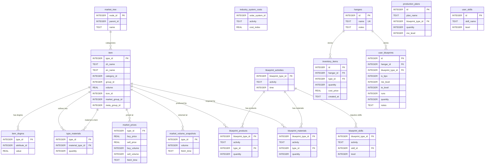

# 数据库 ER 图

## 四库关系总览



## 跨库查询

`services/database_manager.py` 通过 `ATTACH DATABASE` 统一管理 4 个库的连接别名：

| 别名 | 库文件 | 示例跨库查询 |
|------|--------|-------------|
| `ref` | reference.db | `SELECT zh_name FROM ref.item WHERE type_id = ?` |
| `mkt` | market.db | `SELECT sell_price FROM mkt.market_prices WHERE type_id = ?` |
| `bp` | blueprint.db | `SELECT * FROM bp.blueprint_materials WHERE blueprint_type_id = ?` |
| `usr` | user.db | `SELECT * FROM usr.inventory_items WHERE hangar_id = ?` |

跨库 JOIN 示例：
```sql
SELECT i.zh_name, mp.sell_price, ui.quantity
FROM ref.item i
JOIN mkt.market_prices mp ON i.type_id = mp.type_id
LEFT JOIN usr.inventory_items ui ON i.type_id = ui.type_id AND ui.hangar_id = 1
WHERE i.type_id = 34
```
