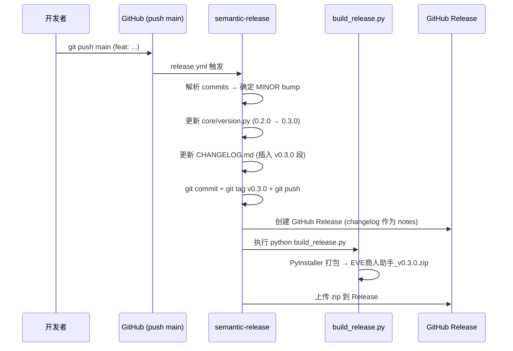

# 版本管理

## 版本策略

项目遵循[语义化版本 2.0.0](https://semver.org/lang/zh-CN/)，当前处于 **0.x 开发阶段**。

### 0.x 阶段规则

依据 [semver-zh.md FAQ](https://semver.org/lang/zh-CN/#faq-如何处理-0xyz-阶段的版本更迭)：

| 规则 | 说明 |
|------|------|
| 每次发版递增 MINOR | 0.2.0 → 0.3.0 → 0.4.0 → … |
| PATCH 位不使用 | 0.x 阶段不存在常规 bugfix 单独发版 |
| 一切可随时改变 | 0.x 阶段公共 API 不保证稳定 |
| 升 1.0.0 的条件 | 功能稳定、API 被外部依赖后 |

### 升级到 1.0.0 后的配置变更

| 配置项 | 0.x 值 | 1.x 值 |
|--------|--------|--------|
| `major_on_zero` | `false` | `true` |
| `minor_tags` | `["feat", "fix", "perf"]` | `["feat"]` |
| `patch_tags` | `[]` | `["fix", "perf"]` |

## 版本管理自动化

### python-semantic-release

采用 [python-semantic-release](https://python-semantic-release.readthedocs.io/) v10 实现全自动发版：

- **触发**：push 到 main
- **解析**：Conventional Commits（`feat:`/`fix:`/`perf:`/…）
- **自动执行**：bump 版本 → 更新 CHANGELOG → 打 tag → 创建 GitHub Release → 打包上传安装包

### 版本源

| 文件 | 作用 | 谁维护 |
|------|------|--------|
| `core/version.py` | 唯一版本源 `__version__ = "0.2.0"` | python-semantic-release 自动改写 |
| `pyproject.toml` `[project].version` | 包元数据版本 | python-semantic-release 自动改写 |
| `CHANGELOG.md` | 更新日志（Keep-a-Changelog 格式） | python-semantic-release 自动插入 |
| git tag `v{version}` | 发版标记 | python-semantic-release 自动创建 |

### 一致性校验

`scripts/check_version.py` 在 CI 中阻断合并：

```
core/version.py.__version__ == CHANGELOG.md 最新版本段 == git tag（发版态）
```

- **开发态**（HEAD 无 tag）：仅校验 version.py == CHANGELOG
- **发版态**（HEAD 有 tag）：三源必须完全一致

## 发版流程



> 关键：semantic-release 使用 `GITHUB_TOKEN` push，不会再次触发 workflow（防止死循环）。

## 手动发版 Checklist

如需手动发版（不通过 semantic-release）：

1. 修改 `core/version.py` 的 `__version__`
2. 更新 `CHANGELOG.md`（在 `<!-- version list -->` 下方添加新版本段）
3. 执行 `python scripts/check_version.py` 确认三源一致
4. `python build_release.py` 打包
5. `git commit` + `git tag v{version}` + `git push --tags`
