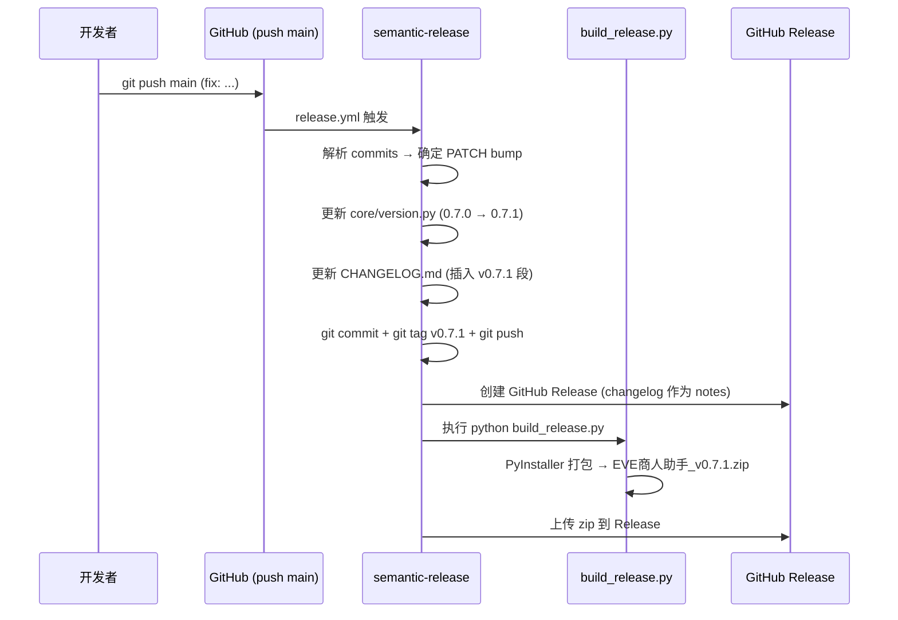

# 版本管理

## 版本策略

项目遵循[语义化版本 2.0.0](https://semver.org/lang/zh-CN/)，当前处于 **0.x 开发阶段**。

### 版本递增规则

遵循 semver 2.0.0，0.x 开发阶段同样适用：

| 提交类型 | 递增位 | 示例 |
|----------|--------|------|
| `feat`（新功能） | MINOR | 0.7.0 → 0.8.0 |
| `fix` / `perf`（修复/优化） | PATCH | 0.7.0 → 0.7.1 |
| 其余（docs/ci/chore/refactor/test/build/style） | 不触发发版 | — |
| 大版本 | 由发布者手动决定 | 1.0.0 及以后 |

### 升级到 1.0.0 后的配置变更

| 配置项 | 当前值 | 1.x 值 |
|--------|--------|--------|
| `major_on_zero` | `false` | `true` |

## 版本管理自动化

### python-semantic-release

采用 [python-semantic-release](https://python-semantic-release.readthedocs.io/) v10 实现全自动发版：

- **触发**：push 到 main
- **解析**：Conventional Commits（`feat:`/`fix:`/`perf:`/…）
- **自动执行**：bump 版本 → 更新 CHANGELOG → 打 tag → 创建 GitHub Release → 打包上传安装包

### 版本源

| 文件 | 作用 | 谁维护 |
|------|------|--------|
| `core/version.py` | 唯一版本源 `__version__ = "0.7.0"` | python-semantic-release 自动改写 |
| `pyproject.toml` `[project].version` | 包元数据版本 | python-semantic-release 自动改写 |
| `uv.lock` 本项目条目 | 锁文件里的项目版本（`package = false`，仅记录） | `uv lock` / `uv sync` 同步 |
| `CHANGELOG.md` | 更新日志（Keep-a-Changelog 格式） | python-semantic-release 自动插入 |
| git tag `v{version}` | 发版标记 | python-semantic-release 自动创建 |

> ⚠️ **`version_toml` 必须写点号路径**：`pyproject.toml:project.version`（`[project] version` 在 dotty 里是 `project.version`）。
> 2026-09-26 前这里写的是 `pyproject.toml:version` —— PSR 的 `TomlVersionDeclaration.replace()`
> 在 key 不存在时**直接返回原文**（其源码里标着 `# TODO: v11 raise KeyError`），于是**静默跳过**：
> pyproject / uv.lock 长期停在 0.24.2，而 `core/version.py` 与 CHANGELOG 已到 0.25.0，
> 期间没有任何检查发现（`check_version.py` 当时只比对后两者）。
> 现已修正路径，并让 `check_version.py` 把 pyproject 一并纳入校验。

### 一致性校验

`scripts/check_version.py` 在 CI 中阻断合并：

```
core/version.py.__version__ == CHANGELOG.md 最新版本段
                           == pyproject.toml [project].version
                           == git tag（发版态）
```

- **开发态**（HEAD 无 tag）：校验 version.py == CHANGELOG == pyproject.toml
- **发版态**（HEAD 有 tag）：四源必须完全一致

> `uv.lock` 不纳入硬校验：PSR 只改写 `version_variables` / `version_toml` 列出的文件，
> 锁文件的项目版本要等下一次 `uv lock` / `uv sync` 才跟上。它只是记录（`[tool.uv] package = false`，
> 本项目不打包成 wheel），所以「锁文件版本滞后」不影响安装结果，不值得为它增加发布流程步骤。

## 发版流程



> 关键：semantic-release 使用 `GITHUB_TOKEN` push，不会再次触发 workflow（防止死循环）。

## 手动发版 Checklist

如需手动发版（不通过 semantic-release）：

1. 修改 `core/version.py` 的 `__version__`
2. 同步 `pyproject.toml` 的 `[project].version`（**别再靠 PSR 之外的路径补**）
3. 更新 `CHANGELOG.md`（在 `<!-- version list -->` 下方添加新版本段）
4. 执行 `uv lock` 让 `uv.lock` 的项目版本跟上（`uv sync` 也会做）
5. 执行 `python scripts/check_version.py` 确认一致
6. `python build_release.py` 打包
7. `git commit` + `git tag v{version}` + `git push --tags`
