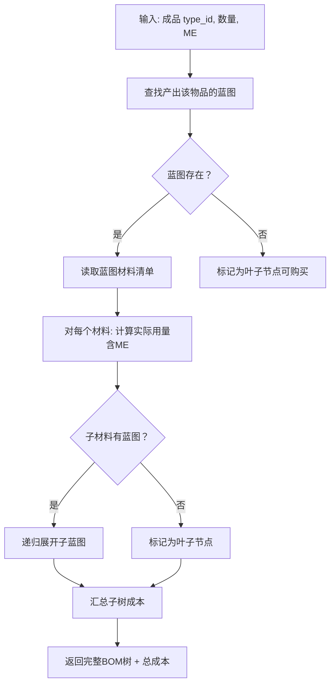

# BOM 管理

BOM（Bill of Materials）递归展开是工业制造的基础功能，从目标成品构建完整的制造材料树。

## 功能说明

`services/bom_expander.py` 的 `expand_bom()` 函数：

1. 从目标成品 `type_id` 开始
2. 递归查找蓝图 → 材料 → 子蓝图 → 子材料
3. 构建完整的制造材料树
4. **叶子节点**为可直接购买的原材料

## 使用示例

```python
from services.bom_expander import expand_bom

result = expand_bom(type_id=30013, quantity=10, bp_me=10)
print(result["full_cost"])         # 总材料成本
print(result["raw_materials"])     # 叶子节点列表
```

## BOM 树节点（BomNode）

每个节点包含以下信息：

| 属性 | 类型 | 说明 |
|------|------|------|
| `type_id` | int | 物品 ID |
| `name` | str | 物品名称（自动解析） |
| `quantity` | float | 所需数量（已含 ME 浪费因子 × 产量倍数调整） |
| `base_quantity` | int | 蓝图中的原始数量 |
| `is_intermediate` | bool | 是否是中间产品（可自己制造） |
| `children` | list[BomNode] | 子节点列表 |
| `depth` | int | 层级深度 |
| `unit_price` | float | 单位价格 |
| `subtotal` | float | 小计（quantity × unit_price） |
| `blueprint_type_id` | int \| None | 对应蓝图 ID（中间产品时有值） |

## 展开流程



## 实际用途

- **采购计划**：汇总所有叶子节点，确定需要购买的原材料清单
- **成本核算**：递归计算整条产业链的材料总成本
- **制造决策**：对比自己制造中间件 vs 直接购买的经济性

## API 参考

完整函数列表详见 [`services/bom_expander.py`](/api/services/bom_expander)。
