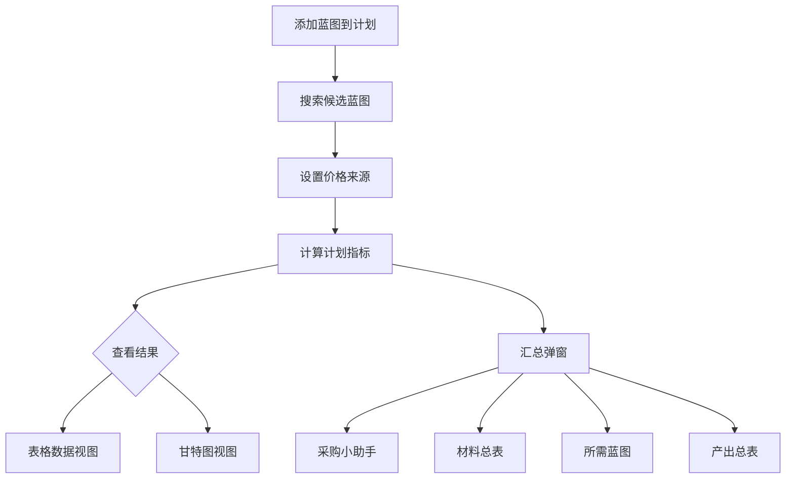

# 工业制造

工业制造是本应用的核心功能，提供从蓝图搜索到利润核算的完整生产计划管理。

## 核心流程



## 添加生产计划

1. 在工具栏点击 **蓝图导入**（`top_toolbar.py`）
2. 输入蓝图名称（支持中/英文模糊搜索候选）
3. 选择蓝图后设置：
   - **数量**：要生产的数量
   - **ME/TE 等级**：蓝图的材料效率和技术效率
4. 点击确认添加到生产计划表格

## 价格来源设置

通过工具栏的 **双行价格设置**（`price_source_widget.py`）独立配置：

| 设置项 | 说明 |
|--------|------|
| 材料 Hub | 材料买入区域（Jita/Amarr/Dodixie/Rens） |
| 材料价格类型 | 买单（Buy）/ 卖单（Sell）/ 均价 |
| 成品 Hub | 成品卖出区域 |
| 成品价格类型 | 卖单（Sell）/ 买单（Buy）/ 均价 |
| 材料倍率 | 材料价调整系数（默认 1.0）。填 1.10 = 材料实际买入价按所选 Hub 报价再加 10% |
| 成品倍率 | 成品价调整系数（默认 1.0）。填 0.95 = 成品实际卖出价按报价再打 95 折 |

> 💡 材料和成品可以使用不同 Hub，实现跨区贸易场景模拟。

**倍率的作用范围**：材料倍率影响所有按材料买入价算的成本 —— 计划表格的「成本」列、
右键「查看核算」的成本明细、母项拆解算价、从蓝图批量加入制造规划时的预览，
以及状态栏右下角的「备料中采购」汇总；成品倍率影响所有按成品卖出价算的收入
（「成品价值」「利润」「利润率」列等）。

> ⚠️ 倍率**不**影响安装费 —— 安装费按 CCP 官方估价（adjusted_price）计税，与玩家实际买卖价无关。

> 🔗 **材料倍率是全局的**：仓库管理页的「库存修正 / 增量粘贴」导入预览、
> 以及「批量设置成本价」，读写的都是**这一个**材料倍率（记住上次的值，不再每次重置）。
> 在那边改完回到本页，工具栏的倍率也会跟着变。

## 并行产线与蓝图等级

一条计划可以并行 N 条产线（`N×流程` 列），每条产线各自绑一张蓝图。
**各条产线按自己那张蓝图的 ME/TE 独立结算**：材料按各线求和、生产时长取**最慢那条**。

- **ME/TE 列**显示各线一致时的等级；各线不一致时显示**最低那组**并在后面带一个 `≠`
  （把鼠标停在格子上会列出每条线分别是什么等级）
- **右键「设置蓝图等级...」只影响「还没绑蓝图」的产线** —— 已绑的产线以各自蓝图的等级为准。
  想改已绑产线的等级，请在「蓝图管理」里改那张蓝图

## 缺料 / 蓝图流程不足时强制启动

启动前如果材料不足、或绑定的蓝图流程数不够，会弹一次确认：
确认后仍可启动（材料按现有库存扣、缺口记待补；蓝图按实际可用流程消耗，**不会**自动补流程或换绑）。

- 只是软件误点、游戏里还没开造 → 用右键「撤销启动（返还材料）」
- 蓝图流程不足强制启动后，账面的流程数会与游戏不符 ——
  之后用「蓝图管理 → 粘贴导入蓝图 → **全量同步**」重新粘贴游戏里的库存即可矫正

## 计划表格列说明

生产计划表格（`plan_table.py`）包含 19 列数据：

| 列 | 含义 |
|----|------|
| 蓝图名 | 蓝图物品名称 |
| 数量 | 计划生产数量 |
| ME | 材料效率等级（0-10） |
| TE | 技术效率等级（0-20） |
| 材料成本 | 所有材料的总买入成本 |
| 安装费 | 系统成本 + 设施税 + SCC 附加费 + 安装费 |
| 成品价值 | 预计成品卖出总价 |
| 单件利润 | (成品价值 - 材料成本 - 安装费) / 数量 |
| 单件利润率 | 单件利润 / 材料成本 × 100% |
| 个人利润率 | 考虑库存成本的综合利润率 |
| 总利润 | 成品价值 - 材料成本 - 安装费 - 税费 |
| 生产时长 | 总制造时间 |
| 所需蓝图数 | 考虑 PE 等级后的蓝图使用数量 |
| 等等... | |

## 个人利润率

`ScoringService.calculate_personal_margin()` 是一个关键算法，综合考虑：

- **市场利润率**：标准的卖出价 - 买入价（所有材料含拆解子项均按市场买入价计）
- **库存成本**：你已拥有的材料按加权平均成本计算
- **混合计算**：部分材料用库存成本（已有），部分用市场价（需购买）

```
个人利润率 = f(市场利润率, 库存成本映射, 生产数量, 平行数)
```

### 拆解母项

母项拆解出子项后，子项是自制件，其成本按**制造价**（子项材料成本 + 子项制造作业费）计入母项成本，
而非市场买入价。因此拆解后的「市场利润率」（子项按市场买入价）通常低于「个人利润率」（子项按自制价），
两列的差异即自制省下的成本。

## 甘特图

切换到 **📊 甘特图**（`gantt_view.py`）查看：

- 各生产计划的时间线
- 产线并行情况
- 生产进度可视化
- 双主题适配（暗色/亮色）

## 定向价格刷新

点击 **🔄 价格刷新** 只拉取当前活跃计划涉及的物品价格：

- 5 分钟缓存 TTL（`TtlLRUCache`）
- 并发 50 请求（aiohttp）
- 进度实时显示在状态栏

## 成本公式参考

安装费计算涉及多个游戏内参数：

- **EIV**（Estimated Item Value）：基于 ESI `adjusted_price`（7 日均价）
- **SCI**（System Cost Index）：系统成本指数，来自 ESI
- **Facility Tax**：设施税率
- **SCC Surcharge**：SCC 附加费
- **Broker Fee**：经纪人费率（受角色技能影响）

详见 [`services/manufacturing_calculator.py`](/api/services/manufacturing_calculator) 和 [`services/scoring_service.py`](/api/services/scoring_service) 的 API 文档。
